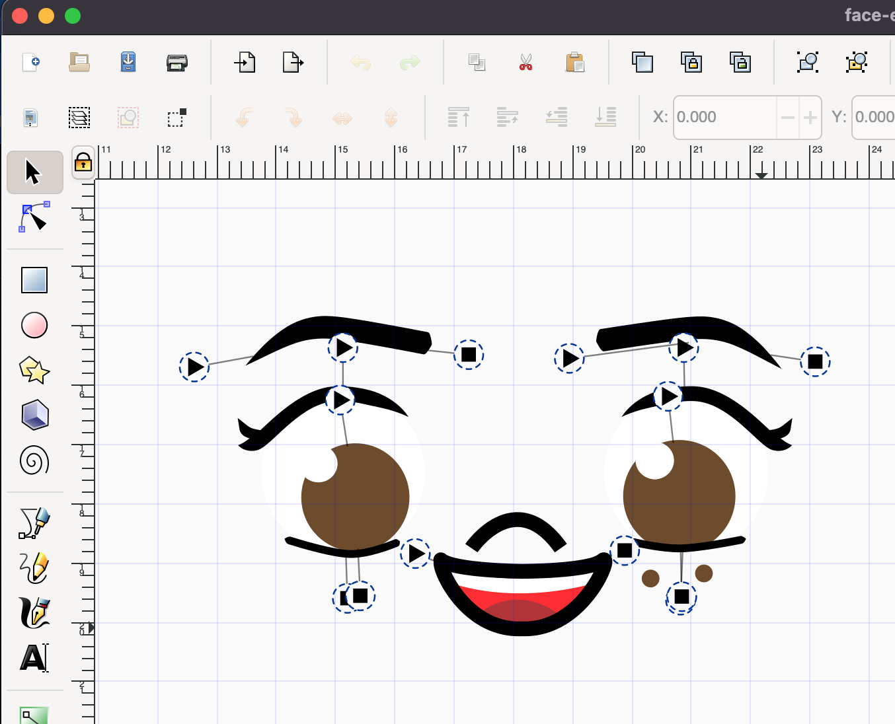

# embroidery

## Stuff I use
* https://inkscape.org/ with https://inkstitch.org/ plugin
* Brother LB-8600 

## Workflow
This workflow is specific to my setup.

1. Create design using Inkscape.
3. Organize layers so that elements stitched first are at the bottom, and elements stitched last are at the top.
4. Minimize color changes by grouping same-color elements (ie: stitch both eye whites before stitching irises)
5. Be sure to preview it using "params" and make adjustments
6. Use "Save a copy" to export the design as a .pes file
7. Turn on Brother embroidery machine
8. Connect computer to embroidery machine using USB cable
9. In Finder or Explorer, design .pes file to embroidery machine and preview design using machine
10. Stitch!

Tips:
* Create borders separate from fills, ie: "iris" and "iris outline" are two separate pieces of geometry
* Try to stitch in an order that minimizes stitching over connections
* Adjust start/stop points using Layer Commands
* Turn off (make not visible) the background circle/guide that comes with Inkstitch's template
