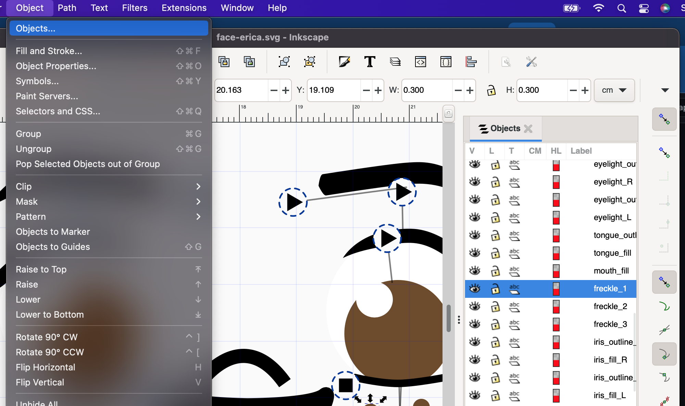
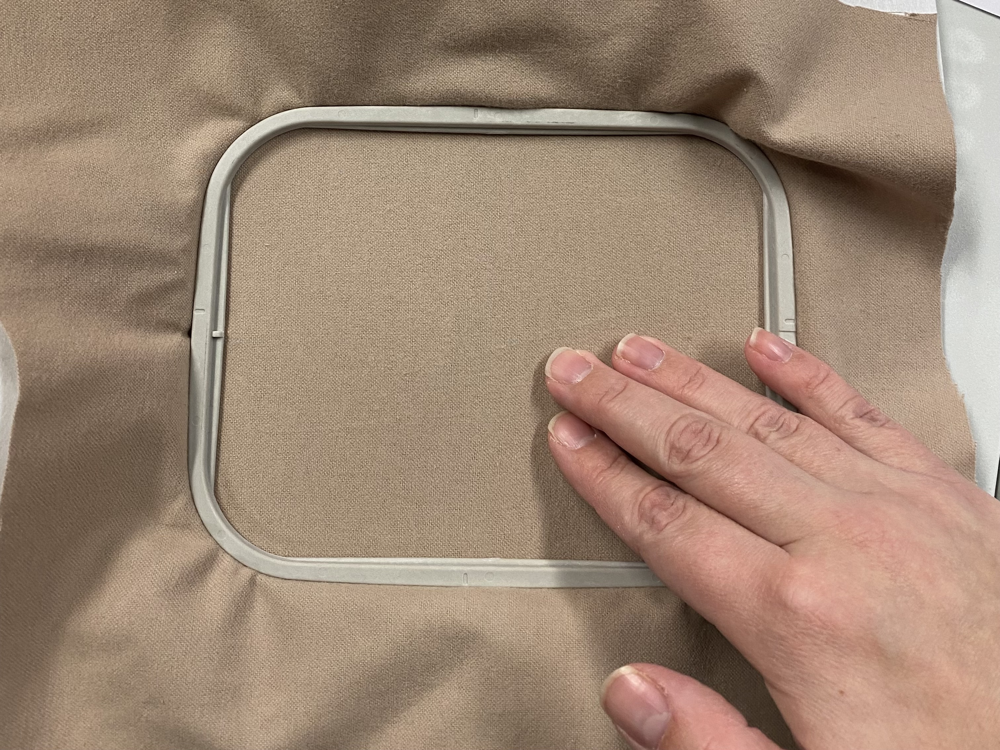
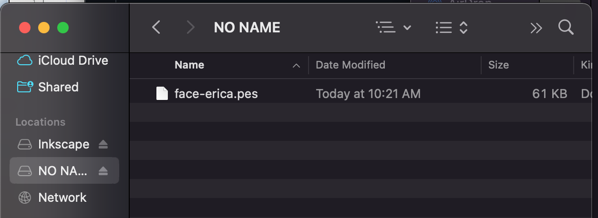
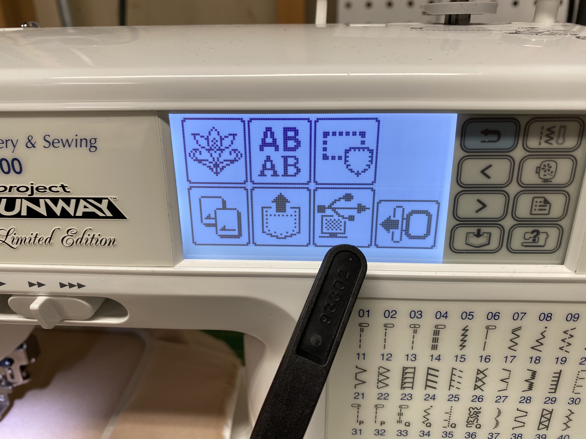
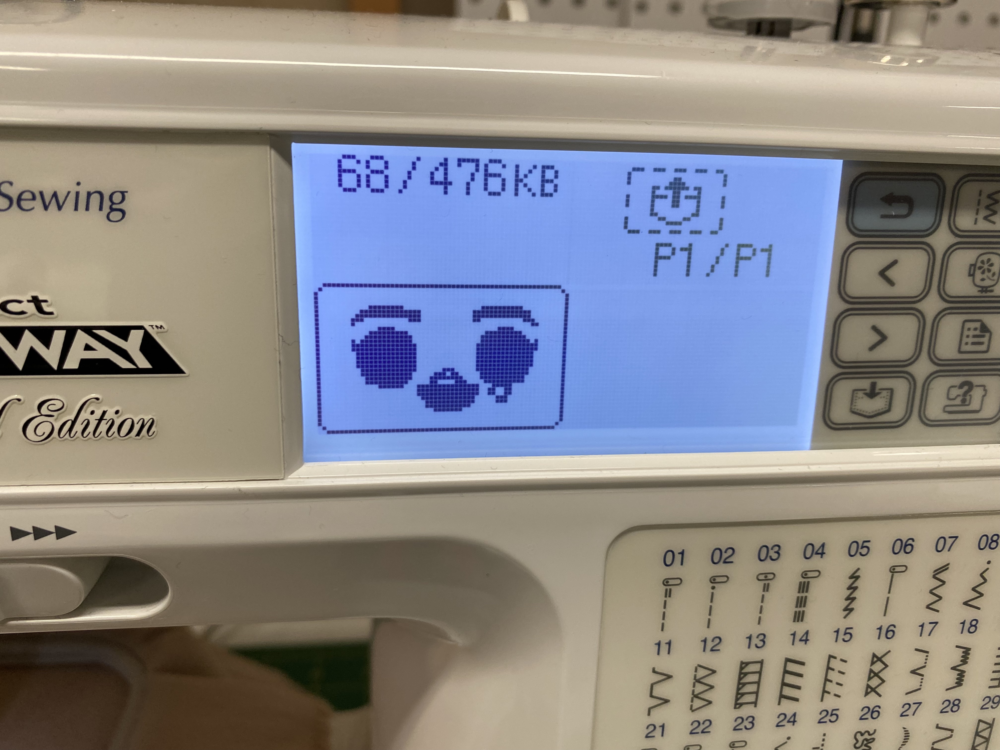
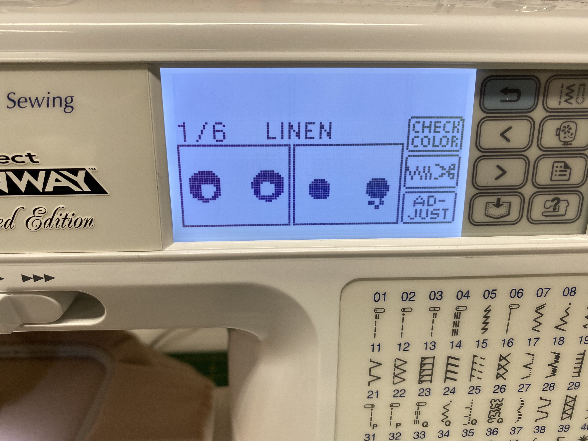

# embroidery
In this repo: my digital embroidery files, and an attempt at documenting my digital embroidery workflow. 

## Stuff I use
* https://inkscape.org/ with https://inkstitch.org/ plugin because they are free and meet my needs
* Brother LB-8600 embroidery machine
* Polystar embroidery thread

## Good resources
* https://www.youtube.com/c/TockCustom This guy's videos are awesome, I learned a ton from watching him
* https://www.reddit.com/r/Inkstitch/ There's a whole subreddit for the Inkstitch plugin
* 
## Workflow

### Creating a digital embroidery design
1. Create a design using Inkscape! Build it out of shapes with fills and lines with outlines. Use separate objects for the fill and the outline. 

Your design is made up of "Objects". 

2. Use "Save a copy" to export the design as a .pes file

Inkscape tips:
* Organize layers so that elements stitched first are at the bottom, and elements stitched last are at the top.
* Minimize color changes by grouping same-color elements (ie: stitch both eye whites before stitching irises)
* Be sure to preview it using "params" and make adjustments
* Create borders separate from fills, ie: "iris" and "iris outline" are two separate pieces of geometry
* Try to stitch in an order that minimizes stitching over connections
* Adjust start/stop points using Layer Commands
* Turn off (make not visible) the background circle/guide that comes with Inkstitch's template

### Preparing your fabric for embroidering

Basically, I make sure that no wrinkles form when I gently push my fingers across the fabric like so.

### Transferring your design to the machine
1. Turn on Brother embroidery machine
2. Connect computer to embroidery machine using USB cable
3. In Finder drag the .pes file to embroidery machine 

4. On the machine, tap on this icon:

5. Tap your design:

### Verifying the design in the machine
This is a "measure twice, cut once" situation where you want to be sure everything's in order before you begin stitching. 

1. Preview the color steps. Ensure they are in the right order, and that the color names make enough sense to you to know what thread to choose. Ie: for some reason, "White" comes through as "linen" so I have to remember that "linen = white".

2. Consider whether you need to rotate the design. I rotate my doll faces 90 degrees.

General tips and advice:

1. Stay at the machine and don't multi-task while stitching. 100% of my mistakes and disasters were a result of attempting to interweave some other project into the stitching wait times, then I come back and load the wrong color or discover the thread broke and I wasn't there.
2. If the thread breaks, you can back up to the stitch it broke at (roughly). This is an imprecise science.
3. If you "restart" a design (maybe you made some edits to the .pes, such as splitting up some elements to be different colors) you can reload the design and skip ahead to the place where you left off. HOWEVER - if your design needs to be ROTATED first, do the rotation FIRST. The machine won't let you choose a different start thread and then do a rotation. (I don't know why, some oversight in its programming maybe. TLDR: rotate first, then pick up where you left off.)
